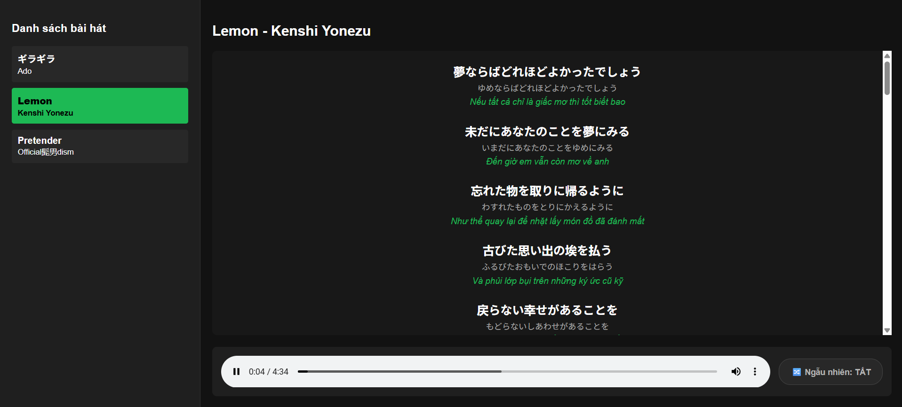

# 🎵 J-Pop Lyric Player with 3-Layer Display

Một ứng dụng phát nhạc cục bộ (Local Music Player) được thiết kế tối ưu cho việc học tiếng Nhật qua bài hát. Ứng dụng tự động quét thư mục nhạc, hiển thị lời bài hát đồng thời với 3 tầng dữ liệu (Kanji - Reading - Meaning) và hỗ trợ chế độ phát ngẫu nhiên (Shuffle).

## ✨ Tính năng nổi bật
- **Quét thư mục thông minh:** Tự động nhận diện cấu trúc file `.mp3` và `.json` ở local, tự động bỏ qua các thư mục không liên quan.
- **Hiển thị lời nhạc 3 tầng (3-Layer Lyrics):** Trực quan hóa câu hát gồm Chữ gốc (Kanji) ➔ Cách đọc (Hiragana) ➔ Nghĩa (Tiếng Việt) giúp tăng hiệu quả học tiếng Nhật.
- **Trình điều khiển thông minh:** Tích hợp tính năng Tự động chuyển bài (Next) và Phát ngẫu nhiên (Shuffle Toggle).
- **Thân thiện với người dùng:** Khởi động toàn bộ hệ thống (Server + UI) chỉ với một cú click chuột thông qua file `Chay_App.bat`.

## 📸 Giao diện ứng dụng

## 🛠️ Công nghệ sử dụng
- **Backend:** Node.js, Express.js (File System manipulation, Static Streaming)
- **Frontend:** Vanilla HTML5, CSS3 (Custom Dark Mode UI), JavaScript (ES6+)
- **Automation:** Windows Batch Script (`.bat`)

## 🚀 Hướng dẫn cài đặt và Chạy thử

### 1. Chuẩn bị
Máy tính của bạn cần cài đặt sẵn [Node.js](https://nodejs.org/).

### 2. Cài đặt
Tải dự án về máy và cài đặt các package cần thiết:
\`\`\`bash
git clone https://github.com/Makibakaelis/jpop-lyric-player.git
cd jpop-lyric-player
npm install
\`\`\`

### 3. Khởi chạy
- Bạn chỉ cần nhấp đúp chuột vào file **`Chay_App.bat`**.
- Hệ thống sẽ tự động bật Server Node.js và mở trình duyệt tại địa chỉ `http://localhost:5000`.

### 4. Hạn chế
- Việc thêm nhạc hiện tại vẫn còn khá thủ công
- Bạn cần chuẩn bị trước: Lyric Kanji gốc, lyric haragana, lyric tiếng Việt, file mp3 của bài cần thêm (bạn có thể bỏ qua việc thêm lyric nhưng khi này, việc hiển thị lời bài hát sẽ xuất hiện những lỗi hiển thị)
- Đọc file **`_IMPORTANT_HOWTOUSE.txt`** trong thư mục musicdata/_converter để tạo file json cho lyrics
    + Tóm tắt: thêm đầy đủ thông tin bài hát trong **`info.txt`**
               thêm lyric cho Kanji, hiragana, tiếng Việt lần lược vào 3 file **`kanji.txt`**, **`reading.txt`**, **`translate.txt`**
               chạy **`converter.py`**
- Thêm file mp3 của bài cần thêm vào thư mục musicdata/ten_bai_hat      